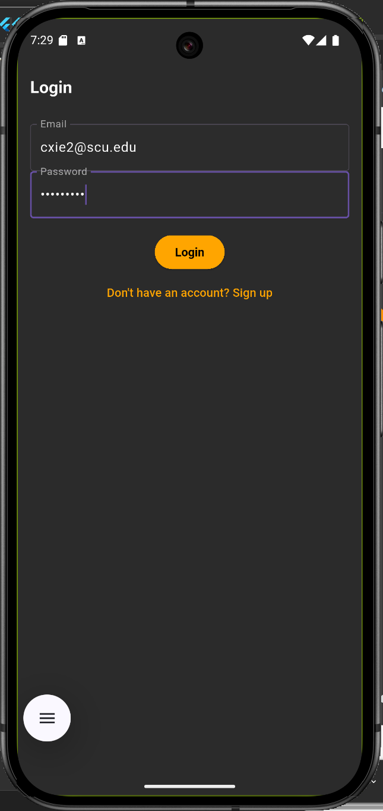
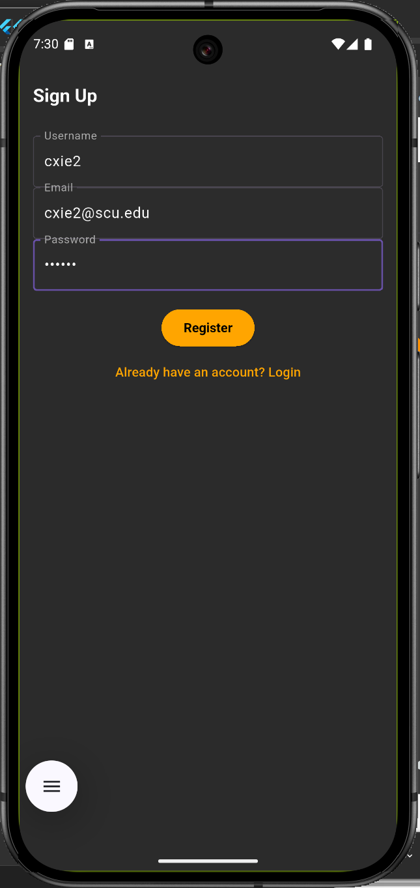
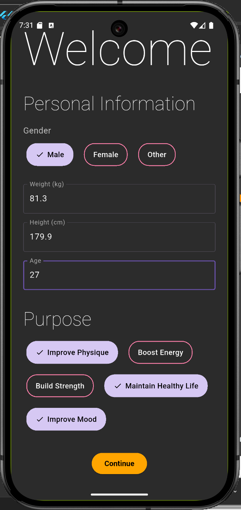
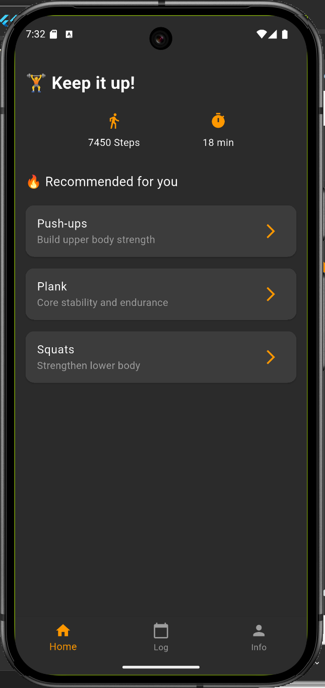
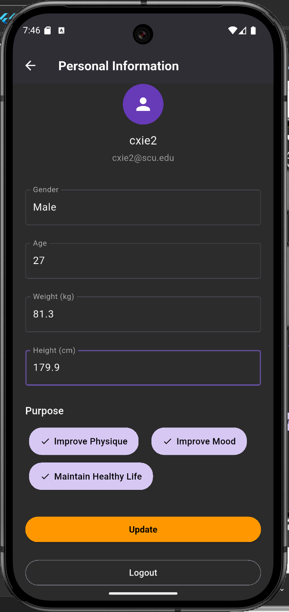
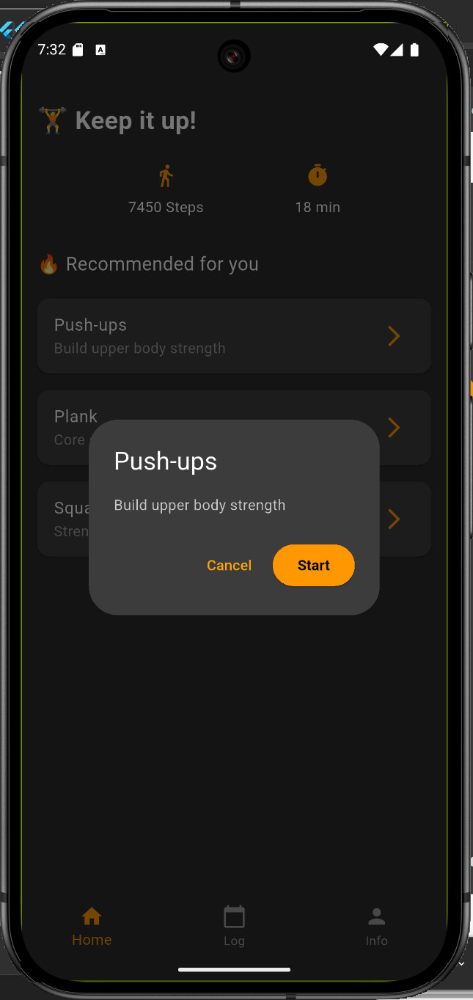
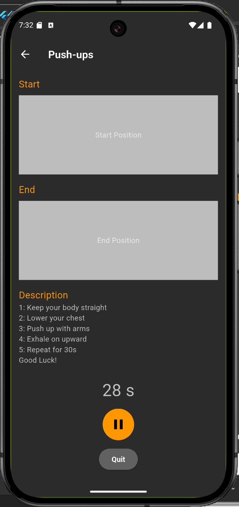

# csen268_final_phase01

A mobile fitness app developed using Flutter.

## 📸 Screenshots

<table>
  <tr>
    <th>Page</th>
    <th>Screenshot</th>
  </tr>
  <tr>
    <td>Login Page</td>
    <td></td>
  </tr>
  <tr>
    <td>Signup Page</td>
    <td></td>
  </tr>
  <tr>
    <td>Welcome Page</td>
    <td></td>
  </tr>
  <tr>
    <td>Home Page</td>
    <td></td>
  </tr>
  <tr>
    <td>Log Page</td>
    <td></td>
  </tr>
  <tr>
    <td>Personal Info</td>
    <td></td>
  </tr>
  <tr>
    <td>Select Workout</td>
    <td></td>
  </tr>
  <tr>
    <td>Start Workout</td>
    <td></td>
  </tr>
  <tr>
    <td>End Workout</td>
    <td></td>
  </tr>
</table>

---

## 📁 Project Structure

lib/

├── component/ # Reusable UI widgets (dropdowns, textfields, buttons)

├── cubit/ # All Cubit state logic

├── model/ # Data models

├── page/ # Main UI pages (Login, Home, LogPage, etc.)

├── repository/ # Abstracted data sources

├── router.dart # GoRouter-based route setup

└── main.dart # Entry point

---
