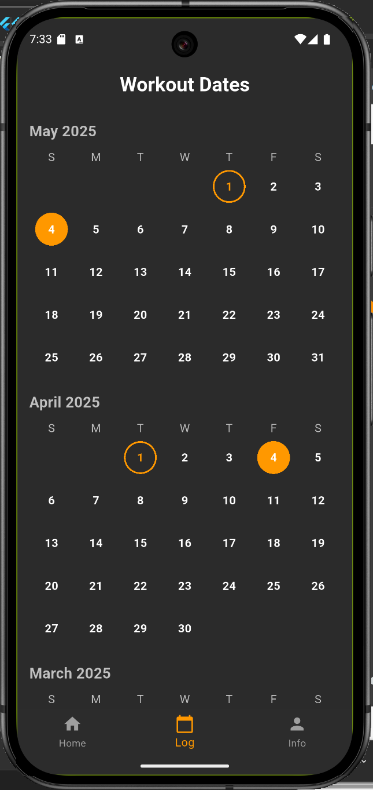
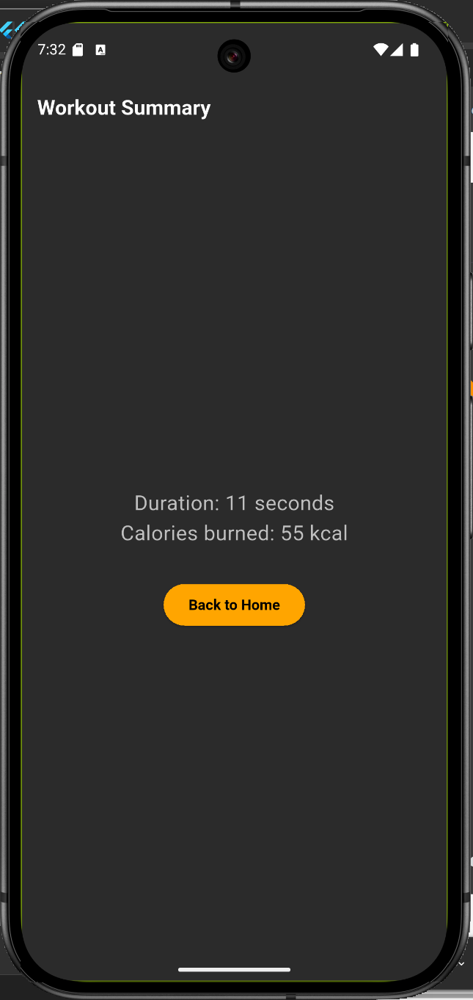

# csen268_final_phase01

A mobile fitness app developed using Flutter.

## 📸 Screenshots

| Page            | Screenshot                                      |
|-----------------|--------------------------------------------------|
| Login Page      |      |
| Signup Page     |    |
| Welcome Page    |  |
| Home Page       |        |
| Log Page        |          |
| Personal Info   |  |
| Select Workout  |  |
| Start Workout   |  |
| End Workout     |  |

---

## 📁 Project Structure

lib/
├── component/ # Reusable UI widgets (dropdowns, textfields, buttons)

├── cubit/ # All Cubit state logic

├── model/ # Hive-compatible data models (User, Workout, Goal)

├── page/ # Main UI pages (Login, Home, LogPage, etc.)

├── repository/ # Abstracted data sources

├── router.dart # GoRouter-based route setup

└── main.dart # Entry point

---
